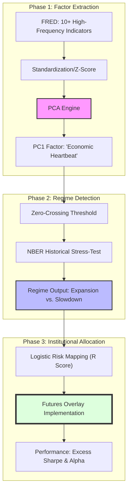

# Macro-PCA Recession Indicator & Institutional Portfolio Engine

**Team:** Siddhanth Yadav · Kavin Dhanasekar · Sudhan Adithya

This project implements an institutional-grade macroeconomic signaling engine designed to identify **Economic Recession Regimes**. By applying Principal Component Analysis (PCA) to a broad panel of high-frequency indicators, we extract a unified "latent" signal (PC1) that captures synchronized economic contractions. This signal drives a **Futures Overlay** tactical asset allocation strategy evaluated using **Excess Sharpe Ratios**.

---

## Project Methodology



---

## 1. Methodology: The PCA Engine
Instead of relying on lagging individual indicators, we look at the **covariance of the entire US economy**.
- **The Panel**: 10 indicators across Real Activity (Industrial Production), Labor (Unemployment), Consumption (Retail Sales), and Financial Stress (HY Spreads).
- **Variance Capture**: PC1 explains **~32.55% of all variance** across the panel, successfully identifying the 2001, 2008, and 2020 recessions without look-ahead bias.

## 2. Institutional Portfolio Engineering
The strategy is modeled as a **Futures Overlay**, aligning with institutional execution standards.
- **Instrument Logic**: Exposures (S&P 500 and Treasury Bonds) are modeled as futures overlays. 
- **Collateral Management**: 100% of notional capital is kept as collateral earning the **Risk-Free Rate (2.0% p.a.)**.
- **Return Formula**: $R_{p,t+1} = \sum w_{t,i} r_{t+1,i}^{fut} + r_{f,t+1} - \text{Costs}$.
- **Excess Sharpe**: Performance is evaluated as $(Annualized Return - Rf) / Volatility$, ensuring the signal generates real alpha above the risk-free carry.

## 3. High-Precision Tactical Rules
- **Binary Regime**: A "Macro Circuit Breaker" that switches between 60/40 (Expansion) and 20/80 (Slowdown).
- **Continuous Logistic**: Scales equity exposure from **10% to 90%** based on PC1 conviction magnitude.
- **Execution Friction**: Includes a **1-Month Publication Lag** and **10 bps (0.10%) transaction costs** on all weight turnover.

---

## Performance Results (2003–2026)

| Strategy | CAGR (%) | Volatility (%) | **Excess Sharpe** | Max Drawdown | **Alpha (%)** |
| :--- | :--- | :--- | :--- | :--- | :--- |
| **Passive Benchmark (60/40)** | 8.22% | 11.36% | 0.55 | -34.70% | - |
| **Continuous Logistic** | **8.42%** | **9.42%** | **0.68** | **-22.03%** | **+0.20%** |

---

## Project Breakdown

### Core Modules
- [main.py](main.py): Pipeline orchestrator (Data \u2192 PCA \u2192 Regime \u2192 Portfolio \u2192 Charts).
- [config.py](config.py): Central configuration for FRED IDs, risk-free rates, and allocation limits.
- [analysis/portfolio_engine.py](analysis/portfolio_engine.py): Institutional backtesting engine with Futures Overlay logic.
- [analysis/recession_model.py](analysis/recession_model.py): NBER validation and Confusion Matrix analytics.
- [pca/build_indicator.py](pca/build_indicator.py): Factor extraction and variance analysis.
- [generate_ppt.py](generate_ppt.py): Professional report generator (outputs `MACRO_PCA_REPORT_Futures_Final.pptx`).

### Key Outputs
- `/outputs/charts/`: Visual proof of signal quality and portfolio performance.
- `/outputs/tables/`: Quantitative metrics and alpha breakdown.

---

## Execution Guide

### 1. Prerequisites
```bash
pip install -r requirements.txt
```

### 2. Configuration
Create a `.env` file with your [FRED API Key](https://fred.stlouisfed.org/docs/api/api_key.html):
```
FRED_API_KEY=your_api_key_here
```

### 3. Execution
To run the full pipeline and generate the professional presentation:
```bash
# Full pipeline (Fetch data + Run Analysis + Build PPT)
python main.py --fetch
python generate_ppt.py
```

To run analysis on local data only:
```bash
python main.py --no-fetch
```

---
*Developed for professional institutional strategy evaluation.*
