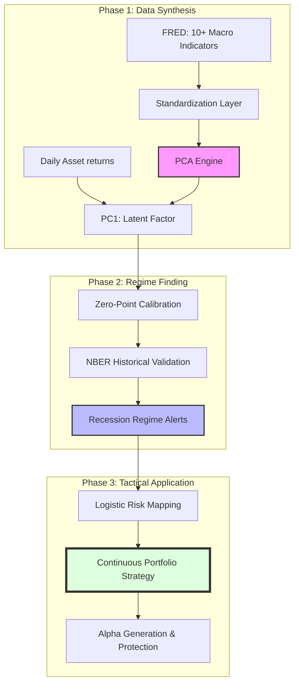

# Macro-PCA Recession Indicator & Portfolio Optimization

**Team:** Siddhant Yadav · Kavin Dhanasekar · Sudhan Adithya

This project implements a robust macroeconomic signaling engine designed to identify **Economic Recession Regimes**. By applying Principal Component Analysis (PCA) to a broad panel of high-frequency indicators, we extract a unified "latent" signal that captures synchronized economic contractions and drives high-precision tactical asset allocation.

---

## Project Methodology



---

## 1. Methodology: The PCA Engine
The core of this project is the **Synthesis of Disparate Data**. Instead of looking at a single number, we look at the covariance of the entire "economic body."

### 10-Variable Macro Panel
We process data from FRED across four pillars:
1.  **Real Activity**: Industrial Production, Mfg New Orders, Capacity Utilization.
2.  **Labor Market**: Unemployment Rate (inverted), Real Personal Income.
3.  **Consumption**: Retail Sales, Housing Starts.
4.  **Financial Proxies**: S&P 500 Returns, Yield Curve (10Y-2Y), HY Spreads.

### Signal Extraction
- **Standardization**: Indicators are standardized into Z-scores.
- **Factor Extraction**: PCA identifies "Principal Component 1" (PC1), explaining **~32.5% of US economic variance**.
- **Interpretation**: PC1 > 0 signals Expansion; PC1 < 0 signals a synchronized Slowdown.

---

## 2. Recession Regime Identification
We calibrate the PC1 signal against 25 years of history (2000-2026).

- **NBER Validation**: The model achieves a **96.4% Recall** against historical NBER recession months.
- **Precision**: By filtering out individual indicator noise, we identify regimes with high macro conviction.

---

## 3. Application: Dynamic Portfolio Optimization
As a practical extension, we developed a tactical strategy that scales equity exposure based on the macro signal.

### Smooth Logistic Mapping
Instead of binary flips, we apply a smooth function to calculate a **Risk Score (0 to 1)**:
- **High-Precision Scaling**: Exact decimal weights (e.g., 68.32% Stocks) are calculated daily.
- **Boom Scenario**: Model allows up to **90% equity exposure** during periods of extreme PC1 strength.

### Performance Summary (2003-2026)
| Metric | Benchmark (60/40) | **Macro-PCA Continuous** | Improvement |
| :--- | :--- | :--- | :--- |
| **Annualized Return** | 8.28% | **8.68%** | **+0.40% (Alpha)** |
| **Sharpe Ratio** | 0.73 | **0.98** | **+34% Efficiency** |
| **Max Drawdown** | -34.70% | **-20.74%** | **+14% Protection** |

---

## Project Structure

```
macro-pca-indicator/
├── main.py                       # End-to-end pipeline runner
├── config.py                     # Hyperparameters & Asset Limits
├── analysis/
│   ├── portfolio_engine.py       # Continuous Backtesting Engine
│   └── recession_model.py        # Regime Classification Logic
├── pca/
│   └── build_indicator.py        # PCA Factor Extraction
├── data/
│   ├── fetch_data.py             # FRED & Finance Data Ingestion
│   └── transform.py              # Z-Score standardization
└── viz/
    └── report_plots.py           # Multi-axis Visualizations
```

---

## Setup & Usage

### 1. Install dependencies
```bash
pip install -r requirements.txt
```

### 2. Configure API Key
Create a `.env` file with your FRED API key:
```
FRED_API_KEY=your_key_here
```

### 3. Run Pipeline
```bash
python main.py --fetch
```

Full technical methodology is available in the [Methodology Report](Methodology_Report.md).
